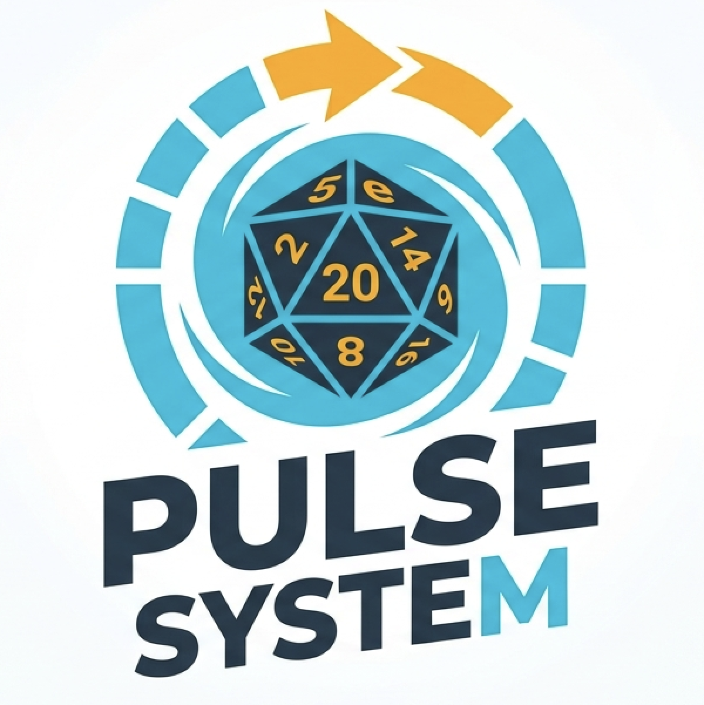

# Pulse Combat



A real-time combat timer app for the Chaos Pulse variant of D&D 5e. Built with [Bun](https://bun.sh) + [Elysia](https://elysiajs.com).

## What It Does

Replaces turn-based initiative with simultaneous energy bars. The DM controls the session from one screen; players join from their own devices and tap buttons when their energy is ready.

## Setup

```bash
bun install
bun run src/index.ts
```

The server prints its local and network addresses on startup. Players navigate to the network address from their phones or tablets.

## Views

| Route | Who uses it |
|---|---|
| `/` | Join screen — enter your name to join as a player |
| `/dm` | DM control panel |
| `/player/:name` | Individual player view |

## DM Controls

- **Start / Pause / Reset** — control the global timer state
- **Fate Timer** — configurable duration (default 30s); when it expires all timers freeze and the DM gets a window to act
- **Continue** — resumes after a Fate pause, refilling the Fate bar
- **Add NPC** — adds a Monster or Minion; monsters get full energy if combat is already running
- **− / +** buttons — adjust any timer duration without a keyboard
- **Tap energy bar** — manually fill or empty any timer

## Player View

Shows the player's own energy bar and action buttons, plus a mini panel of all other timers.

| Button | Energy required | Effect |
|---|---|---|
| ACTION | 100% | Full action — drains bar to 0 |
| Bonus / Move | 50% | Bonus or move action — drains 50% |
| React | 25% | Reaction — drains 25% |

Players set their own timer duration via the DM panel (or the DM adjusts it for them) to reflect DEX modifiers or class features.

## Fate Timer

Every 30 seconds (configurable) all energy bars freeze. During this window the DM can:
- Narrate
- Move NPCs
- Add new enemies (they enter with full energy)
- Resolve death saves

When the Fate timer expires, a chime plays on all connected devices.

## Architecture

- **State** — pure functional, in-memory (`src/state.ts`)
- **Store** — single shared state + WebSocket broadcast (`src/store.ts`)
- **Ticker** — 10 Hz server tick driving the timer (`src/ticker.ts`)
- **App** — Elysia HTTP routes (`src/app.ts`)
- **Server** — Bun.serve with native WebSocket handling (`src/index.ts`)
- **Views** — plain HTML + vanilla JS, no framework (`src/views/`)
- **shared.js** — WebSocket connection, interpolation, audio unlock (served to all views)

## Documentation

- [Chaos Pulse Combat System Overview](docs/pulse_combat_system_overview.md) — full rules, scaling tables, spell handling, stat blocks

## Running Tests

```bash
bun test
```
