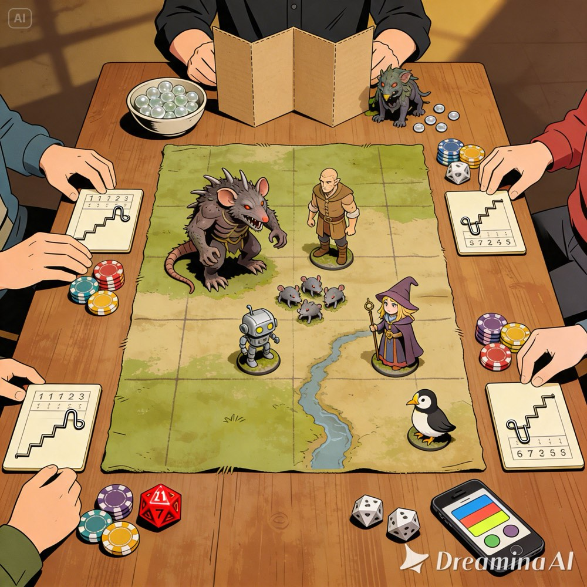

# Chaos Pulse Combat System Overview

A real-time combat variant for D&D 5e that replaces turn-based initiative with simultaneous energy bars and a DM-controlled Fate Timer. All participants act in real time as their energy allows.

## Related Documents

This page covers the core rules. Everything else lives in these living docs:

- [Spell Audit](pulse_combat_spells.md) — spell-by-spell rulings (what's resolved, what's still open), plus confirmed combat stats for the "arach-neds" party
- [Live Test Questions](pulse_combat_live_test_questions.md) — provisional "for now" rulings flagged for reassessment once they've actually been played
- [Playtest Build List](pulse_combat_playtest_build_list.md) — what physically needs to exist before the first live playtest, and every open decision that could still change it
- [Player Placard](placards/player-placard.md), [Mob Placard](placards/mob-placard.md), [DM Placard](placards/dm-placard.md) — the physical card designs, living outlines with worked examples
- [Full design conversation archive](archive/chaos_pulse_conversation_export.md) — the source material these docs were distilled from
- [`chars/`](chars/) — the party's actual character sheets (raw D&D Beyond page saves), used to keep the spell audit and build list grounded in real numbers

*Linkage is intentionally one-way (overview → everything) for now — cross-references between the other docs are still plain filename mentions, not clickable, which keeps updates simpler while these are still living/churning docs. Worth revisiting as the project approaches "launch."*

---

## Core Concept

Every participant — player characters and non-minion enemies — has an **energy bar** that fills continuously over N seconds. When enough energy has accumulated, the player or DM can spend it to take an action. There are no turns; everyone acts simultaneously.

---

## Energy Bars & Timer Duration

| Entity Type | Base Duration (N) | Scaling |
|---|---|---|
| Player Character | 15s | DEX modifier (see below) |
| Monster / Boss | max(10s, 15s − # of PCs) | Scales down as party grows |
| Minion | 15s | No scaling |

### Player DEX Scaling

PC timer duration is reduced by DEX modifier:

- −1s per +2 Dex modifier
- Maximum reduction: −3s (minimum 12s for a high-DEX PC)

*The app fixes all players at 15s by default. Players should set their own duration to reflect their DEX modifier using the DM panel.*

### Monster Scaling

Monster timers shrink as more players join (more pressure = faster monsters), flooring at 10s regardless of party size. Minion timers are unaffected by party size.

---

## Actions

| Action | Energy Cost | Notes |
|---|---|---|
| Full Action | 100% | Attack, cast a spell, use a feature |
| Move / Bonus Action | 50% | Move, bonus action, object interaction |
| Reaction | 25% | Counterspell, opportunity attack, shield |

After spending energy the bar resets and begins refilling immediately.

---

## The Fate Timer

Every **30 seconds** (2× base N), all energy bars pause. This is the **Fate window** — the DM's moment to act:

- Narrate, move NPCs, describe the environment
- Add new waves of enemies (they enter with **full energy** and act immediately on resume)
- Resolve death saves (death saves only occur during Fate pauses)
- Use lair actions or legendary actions

When the DM taps **Continue**, the Fate bar refills and all timers resume. An audible chime signals the Fate pause to all players.

---

## Legendary Resistance

Non-minion enemies may have Legendary Resistance (LR) uses, determined by CR:

> **LR uses = floor(CR ÷ 3)**

| CR | LR Uses |
|---|---|
| 1–2 | 0 |
| 3–5 | 1 |
| 6–8 | 2 |
| 9–11 | 3 |

**Each LR use costs 50% of the current energy bar.** This prevents control spells from instantly removing a boss without rewriting spell mechanics. The DM triggers LR by tapping the Bonus action button on an NPC's timer.

---

## Conditions

**Default: every condition clears the moment the next Fate cycle starts** — i.e. when the DM taps **Continue** and timers resume, not at the pause itself. Paralyzed, Restrained, Frightened, Charmed, Stunned, Dazed, etc. all last at most one Fate cycle. **Exception: Prone does not auto-clear (for now).**

Because the condition is still live for the entire Fate pause, the DM must **"finish the round" before hitting Continue**: resolve every currently-active affliction one last time — for NPCs and PCs alike (ongoing damage, forced saves, whatever the effect calls for) — before it clears. Conditions ride out the pause, then clear; they don't evaporate the instant the bell rings.

**Scope: this rule covers Conditions** — the 5e named list (Paralyzed, Restrained, Frightened, Charmed, Stunned, Dazed, etc.) **and any homebrew status effect with the same shape**: attached to a creature, has a duration or "(save ends)" clause. Example: the Rat King's **Jinxed** (roll the indicated die and subtract it from every attack roll or saving throw while it lasts) isn't a PHB-named condition, but it has the same shape, so it gets the same treatment — clears at the next Fate pause instead of tracking its own "attempt a save to end it early" timing. It does **not** apply to diseases, curses (e.g. lycanthropy from a wererat's bite), or other long-duration afflictions that were never turn-scoped in 5e to begin with — those keep their own real-world/story-scale duration and are unaffected by the Fate timer entirely.

This is a deliberately broad default rather than a per-spell or per-ability ruling — it avoids needing bespoke timing logic for every condition-inflicting spell or feature. A useful side effect: it bounds any real-time "stacking" problem (e.g. Divine Smite or Ensnaring Strike against a paralyzed target) to whatever a character can land within one Fate cycle's worth of actions, since the vulnerable window can't outlive the cycle.

If live play shows this over-nerfs a specific condition or ability (something that's supposed to matter longer than ~30s), track it in `pulse_combat_live_test_questions.md` and add a per-condition exception there — don't rework the default rule itself for one case.

---

## Sneak Attack

**Once per Fate cycle**, regardless of which action type the qualifying hit comes from — full action, bonus action (e.g. an off-hand attack from Two-Weapon Fighting), or reaction (an opportunity attack).

5e's "once per turn" text has no clean Pulse equivalent: bonus actions (50% energy) and reactions (25% energy) refill much faster than the full-action energy bar (see Actions above), so without an explicit cap a Rogue could stack Sneak Attack onto every qualifying hit in a cycle — main attack, off-hand attack, and any opportunity attacks — instead of just one. Capping it per Fate cycle closes that regardless of which action type triggers it.

---

## Companions & Single Summons

A single companion creature (Steel Defender, Find Familiar, etc.) **gets no independent energy timer.** Its owner commands it — Attack, Help, Hide, Dodge, Dash — by spending their own bonus action (50% energy), the same as any other bonus-action ability. The companion gets a reference placard for its own stats (AC, saves, attack) but never its own clock on the table.

This closes design question #6 ("summons and companions can rapidly increase action economy") for the single-companion case: since the companion's action *is* one of the owner's own bonus-action spends, it can never act faster than the owner's single energy bar allows — no doubling, by construction, and no new mechanic invented (vanilla 5e already requires a bonus action to command most companions like this).

This does **not** resolve Conjure Animals or other multi-creature summons — commanding up to eight independent creatures is a much larger question than one companion. But it's a promising lead worth revisiting there: if "one bonus-action command directs exactly one summoned creature" holds for a multi-summon spell too, the same construction that bounds a single companion would also throttle a swarm, without banning the spell outright. See `pulse_combat_spells.md` → Conjure Animals.

The core rule: **"until the end of your next turn" becomes "until the next Fate pause."**

| Spell Type | Handling |
|---|---|
| Damage spells | Play as written |
| Control spells (Hold Person, Banishment, etc.) | Last until next Fate pause (see Conditions above); single save on initial effect; LR can negate |
| Concentration buffs/debuffs | Last until next Fate pause or concentration ends |
| Counterspell | One success stops the spell; all casters who attempted spend a token |
| Healing | Works normally |
| Spells with per-turn effects | Scale to Fate duration (1 round ≈ 1 Fate cycle) |

Spell tokens physically limit per-encounter uses and track ongoing effects (e.g. flip a Hold Person token to show Paralyzed).

---

## Minions

Minions follow the **Flee, Mortals!** (MCDM) minion rules, adapted directly rather than reinvented:

- **Instant Death:** a minion dies immediately from any damage dealt by a successful weapon attack, or on a failed saving throw — the amount doesn't matter for a single-target hit.
- **Area Effects:** an AoE spell only kills a minion if its damage equals or exceeds that minion's printed max HP (max HP still matters — see Overkill below).
- **Simplified Math:** no fluctuating health pool. A minion is alive or dead; there's no "wounded" state to track between hits.
- **Average Damage:** minions' own attacks use flat average damage instead of rolling per swing, to keep large minion counts fast to run.
- **Group Attacks:** the DM can resolve several minions' attacks as a single action, the same way one monster acts.
- **Overkill / Cleave:** if damage against one minion exceeds its max HP, the excess (`damage − target's max HP`) carries over and can kill an **adjacent** minion, cascading further if excess remains. One big swing can chain through several minions.

15s energy timer, unaffected by party size. No Legendary Resistance. Tracked with HP beads; DM removes beads as damage lands (beads still matter for the Overkill math and the AoE "equals or exceeds max HP" check, even though a minion never sits at partial HP from a normal hit).

**Open for Pulse specifically (not covered by the source rule):**
- "Adjacent" is built for a grid; Pulse plays gridless with tactile minis. Needs an operational definition — nearest mini to the target? any minion in the same DM-grouped batch (ties to Group Attacks above)? Not yet decided.
- Does Overkill cleave carry across multiple hits within one Multiattack action, or does each hit's excess get calculated and discarded independently? Not decided.

---

## Health Tracking

- **Players:** a printed numbered HP track across the top of the placard, with a sliding paperclip marker instead of a bead bowl (see `docs/placards/player-placard.md` → Decisions log, 2026-09-01).
- **Minions:** small bead counters, 1–2 PC hits kills.
- **Boss:** large bead counter (100–250 for high-CR encounters).

---

## Scaling Reference

### Level 2 Party (4 PCs → monster N = 11s)

| Enemy | HP | CR | N | LR |
|---|---|---|---|---|
| Lieutenant | 30–40 | ½–1 | 11s | 0 |
| Boss | 90–100 | 2 | 12s | 0 |
| Minions | 5 | ½ | 15s | 0 |

### Level 8 Party (4 PCs → monster N = 11s)

| Enemy | HP | CR | N | LR |
|---|---|---|---|---|
| Lieutenant | 80 | 4 | 11s | 1 |
| Boss | 250 | 8 | 12s | 2 |
| Minions | 10 | ½ | 15s | 0 |

---

## DM Workflow

1. Set Fate timer duration and NPC durations before starting
2. Hit **Start** — all timers begin filling
3. Players act as their energy allows; DM taps NPC actions as timers fill
4. When Fate fires, add new enemies, narrate, resolve death saves
5. Before hitting Continue, resolve any still-active conditions one last time for every creature — PCs and NPCs — then clear them
6. Hit **Continue** to resume — any NPCs just added enter with full energy
7. Apply LR (Bonus action tap) when a control spell would otherwise lock out a boss
8. Adjust NPC HP and timer duration mid-encounter if needed to maintain tension

---

## Sample NPC Stat Blocks

### Lieutenant (CR 4)
- HP: 80 | AC: 16 | Speed: 30 ft
- Attack: Longsword +7, 1d8+4 slashing
- LR: 1 use | N: 11s
- Tactic: focused attacks on one PC

### Boss (CR 8)
- HP: 250 | AC: 17 | Speed: 30 ft
- Attack: Greatsword +9, 2d6+5 slashing; Multiattack ×2
- Optional: Fireball 6d6 (15 ft cone, recharge 3 Fate cycles)
- LR: 2 uses | N: 12s

### Minion
- HP: 10 | AC: 13 | Speed: 30 ft
- Attack: Shortsword +3, 1d6+1
- N: 15s | No LR
